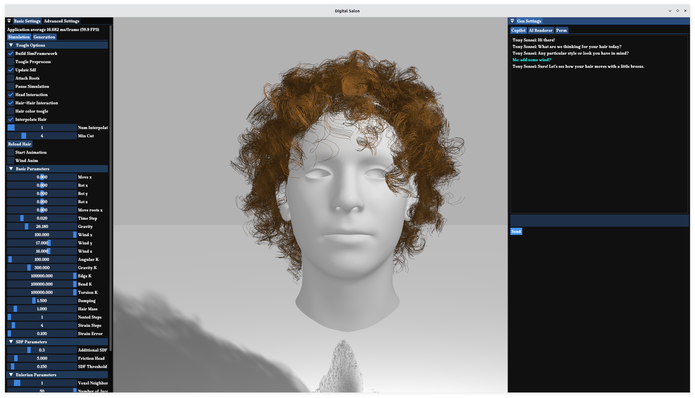

# Installing Digital Salon

Before proceeding to the installation steps, make sure you have CUDA Toolkit 11.6 (or later) installed on your machine. Please follow the installation guide provided by NVIDIA for [Microsoft Windows](https://docs.nvidia.com/cuda/cuda-installation-guide-microsoft-windows/index.html) and [Linux](https://docs.nvidia.com/cuda/cuda-installation-guide-linux/).

## Core Components

### Linux

Take Ubuntu 22.04 for example, to install third-party libraries, run:
```bash
sudo apt install libeigen3-dev libglm-dev nlohmann-json3-dev libassimp-dev libboost-all-dev libfreeimage3 libfreeimage-dev libfreeimageplus-dev python3-dev
```

To compile this project using CMake, run:
```bash
bash scripts/build.sh
```
The built binary file will be generated under `bin`. To execute it, run:
```bash
cd bin
./DigitalSalon
```

### Windows

To install this project on Windows using CMake, the steps are as following:

- Replace the path for dependencies in `cmake/windows.cmake`.
- Configue, Generate and Compile.
- Copy the DLLs from `extern/lib_bin` to the instalation folder (e.g. `bin` or `build`, it should contain `DigitalSalon.exe`). 
- Create a folder named `Export` at the installation folder (e.g. `bin/Export`), here everything (hair, animations, volumetric SDF) will be saved. 

### Sanity Check

To check whether your installation is successful, type `"add some wind?"` under `Gen Settings/Copilot` and you will start to see the vibration of hair. At the same time, your terminal will print something like:
```
set wind speed.
Start simulation.
Building additional VBOs...done
Building simulation data... generated 200460 particles
Sending data to solver... there are 200460 particles on GPU. 
CUDA will use 784 blocks, 256 threads for the hair; also 1024 blocks, 256 threads for the grid
```


## Copilot

To enable Copilot features for text-guided hair generation, you can use the following commands with Miniconda3 to create and activate the Python environment:
```bash
conda create -n digital-salon python=3.10
conda activate digital-salon
conda install pytorch==2.4.1 torchvision==0.19.1 torchaudio==2.4.1 pytorch-cuda=12.1 -c pytorch -c nvidia
pip install -r requirements.txt
```

We provide pre-computed data on USC-HairSalon, including resampled strand data, rendered images, and CLIP embeddings captioned for each hairstyle. They can be downloaded from these OneDrive links ([s3.zip](https://yaleedu-my.sharepoint.com/:u:/g/personal/chengan_he_yale_edu/EUT5lUdAZbFHhvnlyRYF29cBImNMupDEKDMqSnhSF36qgw?e=i4vri5) and [usc-hair-resampled.zip](https://yaleedu-my.sharepoint.com/:u:/g/personal/chengan_he_yale_edu/EZUbewJcyzpCo7iMjwZr7MQBPr_gLmKFzP8_l5rQDbYioQ?e=2bwevv)).
After downloading and unzipping these files, their paths need to be modified to accommodate your specific case, e.g., Line 14 & 15 (`data_root` and `hair_data_root`) in `extern/copilot/text_to_hair.py`.

To check wheter copilot features are successfully enabled, type `"I want a funny hairstyle with curls that add volume and texture"` under `Gen Settings/Copilot` and our system will provide 3 renderings for you to choose. You can click either one of them to load the corresponding hair data.

If something goes wrong, check whether the conda environment is successfully installed and activated, and make sure `data_root` and `hair_data_root` are set to the correct path in `extern/copilot/text_to_hair.py`.

## ControlNet

To enable rendering features for text-based image generation, you need to clone and install [ControlNet](https://github.com/lllyasviel/ControlNet-v1-1-nightly) according to the instructions provided in their `README`. The checkpoints for Stable Diffusion 1.5 (`v1-5-pruned.ckpt`) and ControlNet Canny (`control_v11p_sd15_canny.pth`) need to be downloaded separately and put in the folder `{controlnet_root}/models`. `controlnet_root` can be an arbitraty path to install ControlNet, but the corresponding value should be updated in `extern/controlnet/canny_controlnet_api.py` (Line 12).

To check wheter ControlNet is successfully installed and connected, switch to `Gen Settings/AI Renderer` and type the prompt you would like for the rendering (e.g., `female`, `funny hairstyle with curls that add volume and texture`, `slightly looking left`, `wear a sweater`) and click the `generate` button. It will execute ControlNet's code and after a few seconds, a window with the rendered image will pop up:
